# track.nvim

## Features

- multiple flows
  - allow multiple marks in different flows on same line
- list marks in a tree view
  - change mark order
  - support level
  - navigate to mark
  - preview mark
  - filter with flow
- mark
  - select flow, write content
  - reset flow and content
  - decorate
  - decorate marks when enter new buffer
  - update mark lnum when buffer text changed
  - update mark file_path when buffer name changed
- flow
  - create flow
  - edit flow
  - delete flow

## Architecture

### App

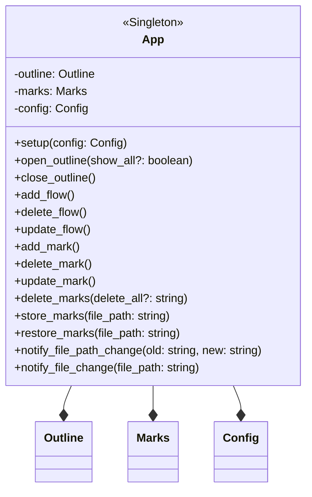

- App.add_mark

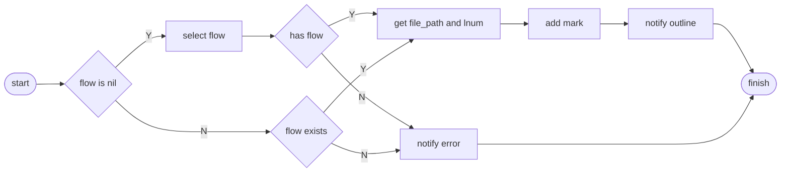

### Marks

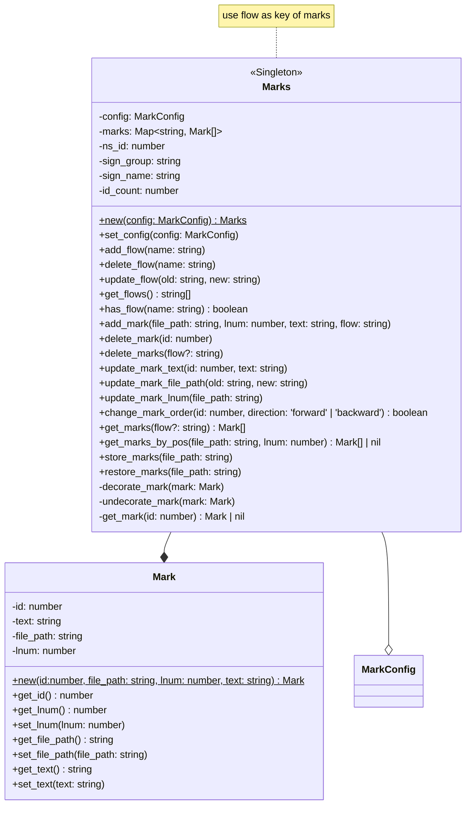

- Marks.add_flow

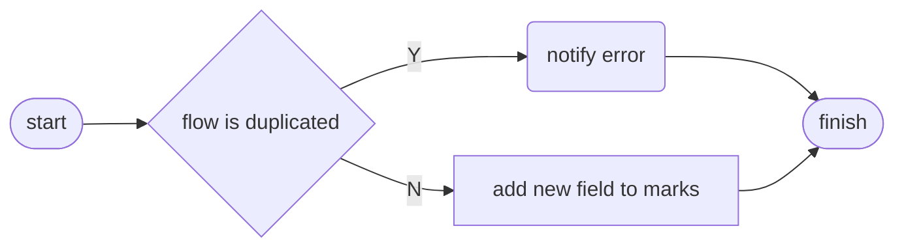

- Marks.update_flow

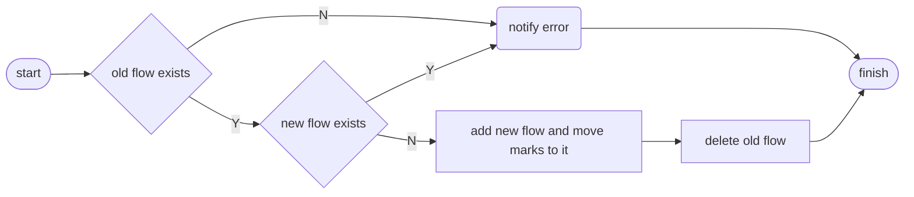

- Marks.set_config

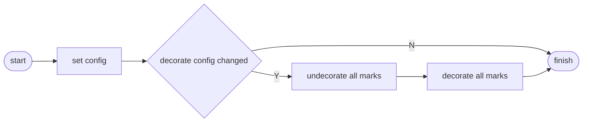

- Marks.add_mark

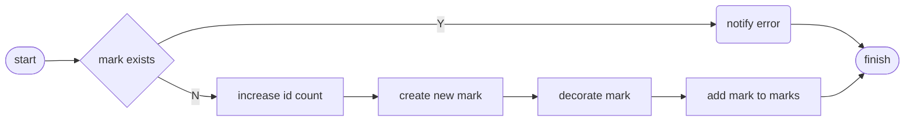

- Marks.delete_mark

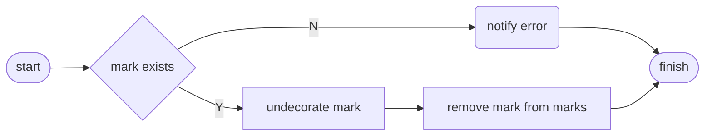

- Marks.update_mark_text

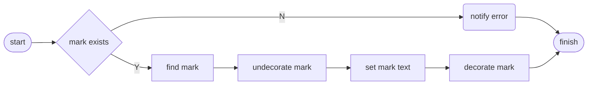

- Marks.decorate_mark

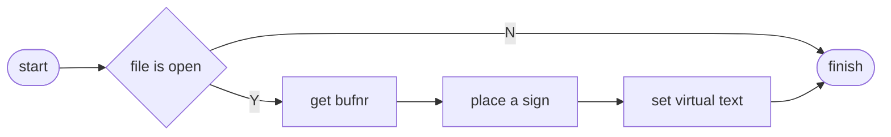

### Outline

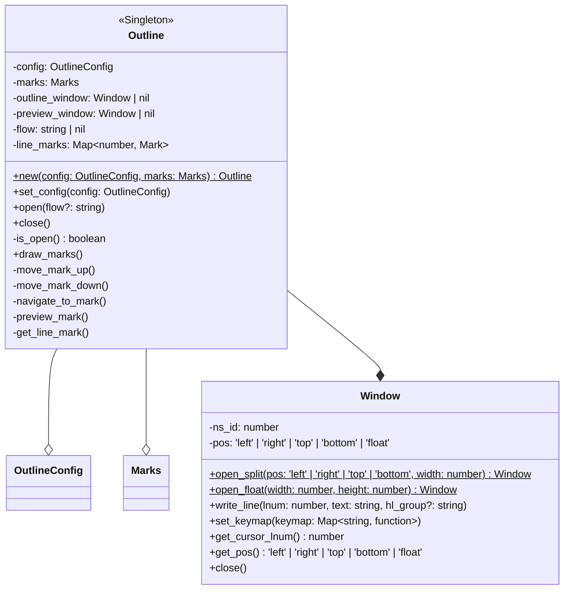

- Outline.open

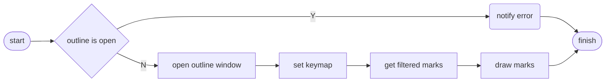

- Outline.set_config

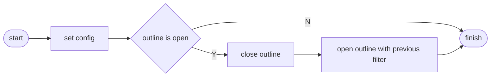

- Outline.draw_marks

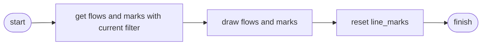

- Outline.move_mark_up

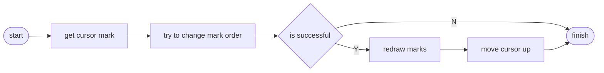

- App flow/mark method

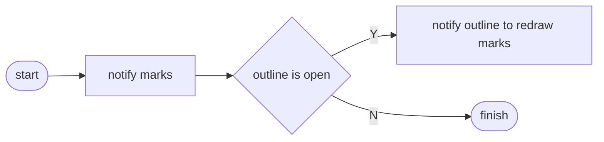

### Config

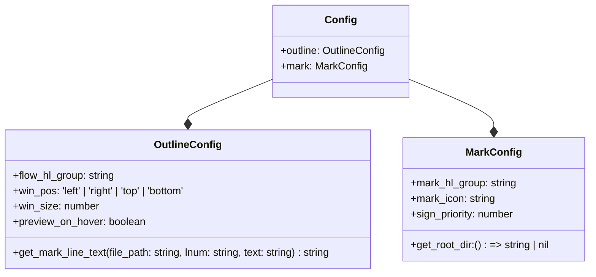
