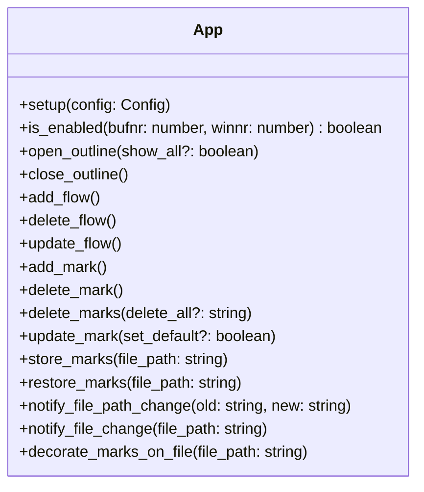
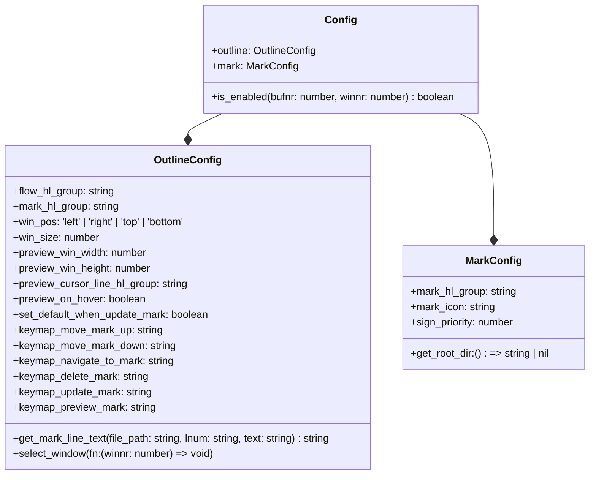

# track.nvim

- Enhanced mark with description.
- Track the thought process of analyzing code.

[More neovim plugins](https://github.com/niuiic/awesome-neovim-plugins)

## Features

- flow
  - multiple flows
  - multiple marks in different flows on same line
- outline
  - list flows and marks
    - filter with flow
  - move mark up/down
  - navigate to mark
  - preview mark
  - edit mark
  - delete mark
- mark
  - decorate
  - edit text
  - delete
    - batch delete
  - store/restore

## Usage


Available functions.



You may need a session plugin for storing/restoring marks. Check [niuiic/multiple-session.nvim](https://github.com/niuiic/multiple-session.nvim).

If there is no highlight on your preview window, try to set filetype.

```lua
vim.filetype.add({
	extension = {
		ts = "typescript",
	},
})
```

## Config

- default config

```lua
local screen_w = vim.opt.columns:get()
local screen_h = vim.opt.lines:get() - vim.opt.cmdheight:get()
local preview_win_width = math.floor(screen_w * 0.6)
local preview_win_height = math.floor(screen_h * 0.6)

local default_config = {
	is_enabled = function()
		return true
	end,
	mark = {
		mark_hl_group = "WarningMsg",
		mark_icon = "󰍒",
		sign_priority = 10,
		get_root_dir = function()
			return vim.fs.root(0, ".git") or vim.fn.getcwd()
		end,
	},
	outline = {
		flow_hl_group = "FloatBorder",
		mark_hl_group = "WarningMsg",
		win_pos = "left",
		win_size = 30,
		preview_win_width = preview_win_width,
		preview_win_height = preview_win_height,
		preview_on_hover = true,
		preview_cursor_line_hl_group = "CursorLine",
		set_default_when_update_mark = false,
		keymap_move_mark_up = "<A-k>",
		keymap_move_mark_down = "<A-j>",
		keymap_navigate_to_mark = "<cr>",
		keymap_delete_mark = "d",
		keymap_update_mark = "e",
		keymap_preview_mark = "p",
		get_mark_line_text = function(_, _, text)
			return text
		end,
		select_window = function() end,
	},
}
```

- config type


