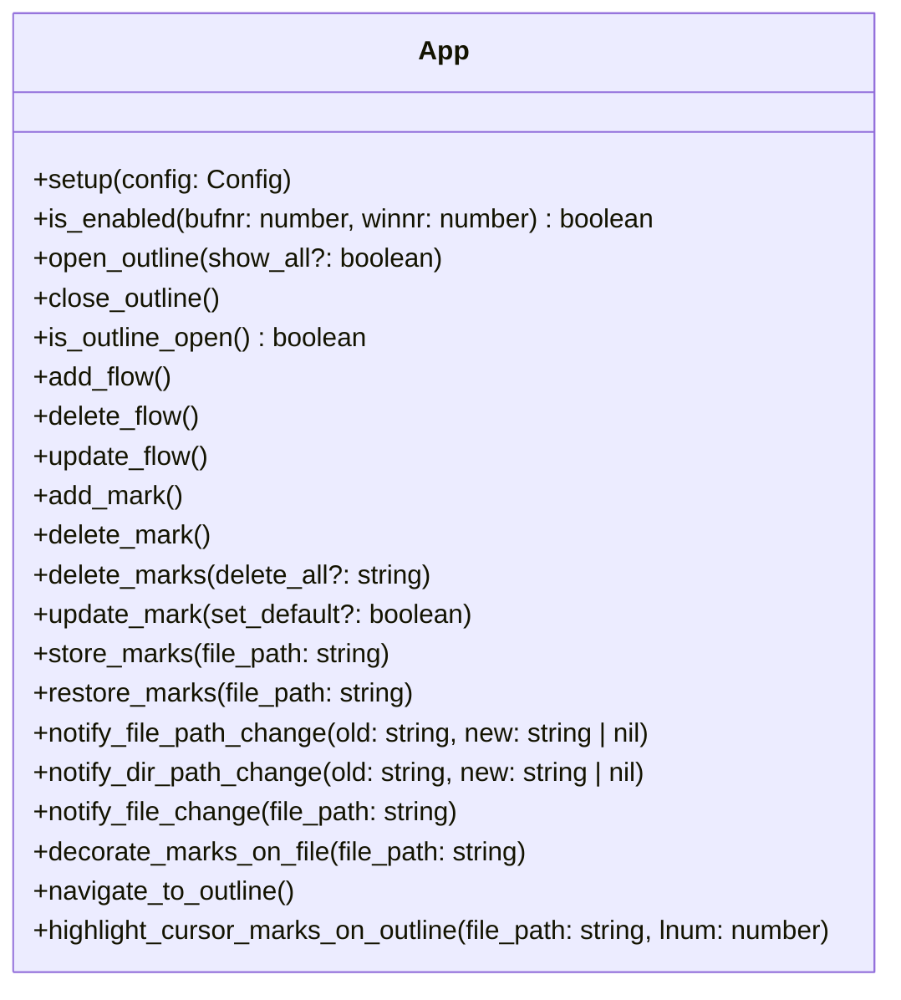
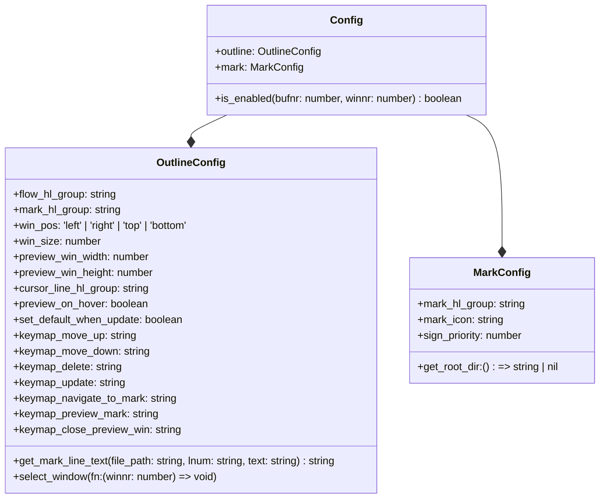

# track.nvim

- Enhanced mark with description.
- Track the thought process of analyzing code.

[More neovim plugins](https://github.com/niuiic/awesome-neovim-plugins)

## Features

- flow
  - multiple flows
  - multiple marks in different flows on same line
- outline
  - list flows and marks
    - filter with flow
  - move mark/flow up/down
  - navigate to mark
  - preview mark
  - edit mark/flow
  - delete mark/flow
  - highlight current marks
- mark
  - decorate
  - edit text
  - delete
    - batch delete
  - store/restore

## Usage

- showcase


- available functions



- update marks when file change

Line number of mark would be updated when buffer saved by default.

```lua
vim.api.nvim_create_autocmd("BufWritePost", {
	callback = function(args)
		if require("track").is_enabled(args.buf, vim.api.nvim_get_current_win()) then
			local file_path = vim.api.nvim_buf_get_name(args.buf)
			require("track").notify_file_change(file_path)
		end
	end,
})
```

It's recommended to update marks when file/dir renamed/moved/deleted. Take `nvim-tree.lua` for example.

```lua
local api = require("nvim-tree.api")
local opts = function(desc)
	return { desc = "nvim-tree: " .. desc, buffer = bufnr, noremap = true, silent = true, nowait = true }
end
local cut_files = {}
local cut_dirs = {}
vim.keymap.set("n", "p", function()
	local node = api.tree.get_node_under_cursor()
	api.fs.paste()
	for _, path in ipairs(cut_files) do
		require("track").notify_file_path_change(
			path[1],
			node.type == "file" and node.parent.absolute_path or node.absolute_path .. "/" .. path[2]
		)
	end
	for _, path in ipairs(cut_dirs) do
		require("track").notify_dir_path_change(
			path[1],
			node.type == "file" and node.parent.absolute_path or node.absolute_path .. "/" .. path[2]
		)
	end
	cut_files = {}
	cut_dirs = {}
end, opts("paste"))
vim.keymap.set("n", "r", function()
	local node = api.tree.get_node_under_cursor()
	local old = node.absolute_path
	api.fs.rename()
	local new = api.tree.get_node_under_cursor().absolute_path
	if node.type == "file" then
		require("track").notify_file_path_change(old, new)
	else
		require("track").notify_dir_path_change(old, new)
	end
end, opts("rename"))
vim.keymap.set("n", "d", function()
	local node = api.tree.get_node_under_cursor()
	local target_buf = vim.iter(vim.api.nvim_list_bufs()):find(function(x)
		return string.find(vim.api.nvim_buf_get_name(x), node.absolute_path, 1, true) ~= nil
	end)
	if target_buf then
		require("mini.bufremove").delete(target_buf)
	end
	api.fs.remove()
	if node.type == "file" then
		require("track").notify_file_path_change(node.absolute_path)
	else
		require("track").notify_dir_path_change(node.absolute_path)
	end
end, opts("remove"))
vim.keymap.set("n", "x", function()
	local node = api.tree.get_node_under_cursor()
	api.fs.cut()
	if node.type == "file" then
		table.insert(
			cut_files,
			{ node.absolute_path, string.match(node.absolute_path, node.parent.absolute_path .. "/(.*)") }
		)
	else
		table.insert(
			cut_dirs,
			{ node.absolute_path, string.match(node.absolute_path, node.parent.absolute_path .. "/(.*)") }
		)
	end
end, opts("cut"))
```

- store/restore marks

You may need a session plugin for storing/restoring marks. Check [niuiic/multiple-session.nvim](https://github.com/niuiic/multiple-session.nvim).

- preview mark

If there is no highlight on your preview window, try to set filetype.

```lua
vim.filetype.add({
	extension = {
		ts = "typescript",
	},
})
```

## Config

- default config

```lua
local screen_w = vim.opt.columns:get()
local screen_h = vim.opt.lines:get() - vim.opt.cmdheight:get()
local preview_win_width = math.floor(screen_w * 0.6)
local preview_win_height = math.floor(screen_h * 0.6)

local default_config = {
	is_enabled = function()
		return true
	end,
	mark = {
		mark_hl_group = "WarningMsg",
		mark_icon = "󰍒",
		sign_priority = 10,
		get_root_dir = function()
			return vim.fs.root(0, ".git") or vim.fn.getcwd()
		end,
	},
	outline = {
		flow_hl_group = "FloatBorder",
		mark_hl_group = "WarningMsg",
		win_pos = "left",
		win_size = 30,
		preview_win_width = preview_win_width,
		preview_win_height = preview_win_height,
		preview_on_hover = true,
		cursor_line_hl_group = "CursorLine",
		set_default_when_update = false,
		keymap_navigate_to_mark = "<cr>",
		keymap_move_up = "<A-k>",
		keymap_move_down = "<A-j>",
		keymap_delete = "d",
		keymap_update = "e",
		keymap_preview_mark = "p",
		keymap_close_preview_win = "q",
		get_mark_line_text = function(_, _, text)
			local space, content = string.match(text, "([%s]*)(.*)")
			return space .. "- " .. content
		end,
		select_window = function() end,
	},
}
```

- config type


